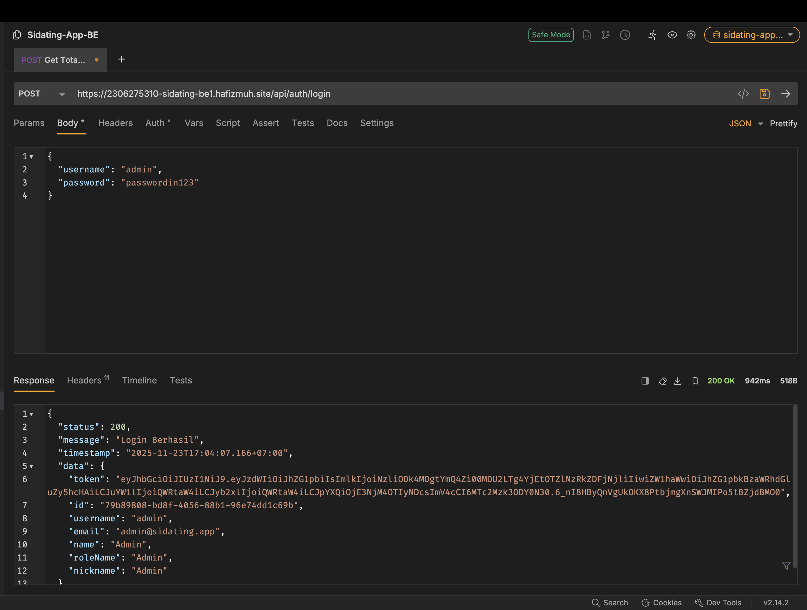
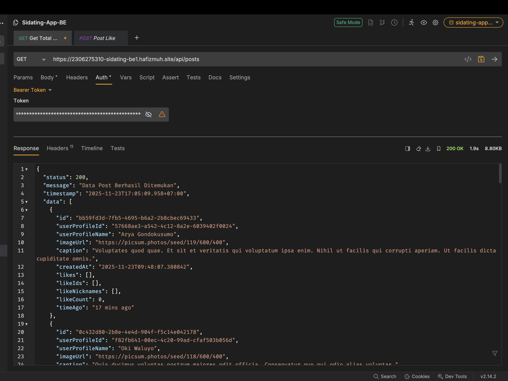
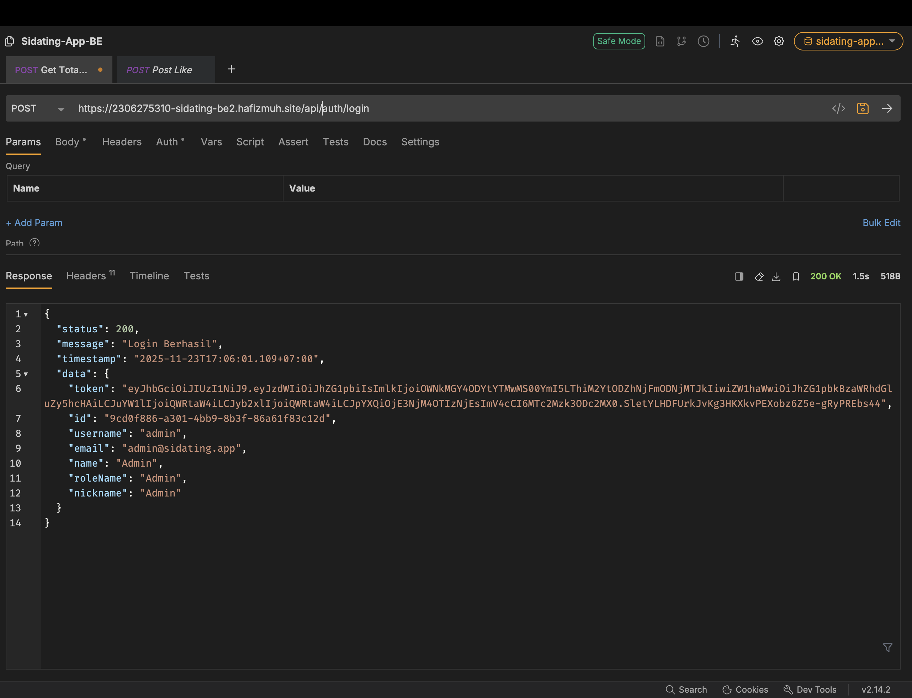
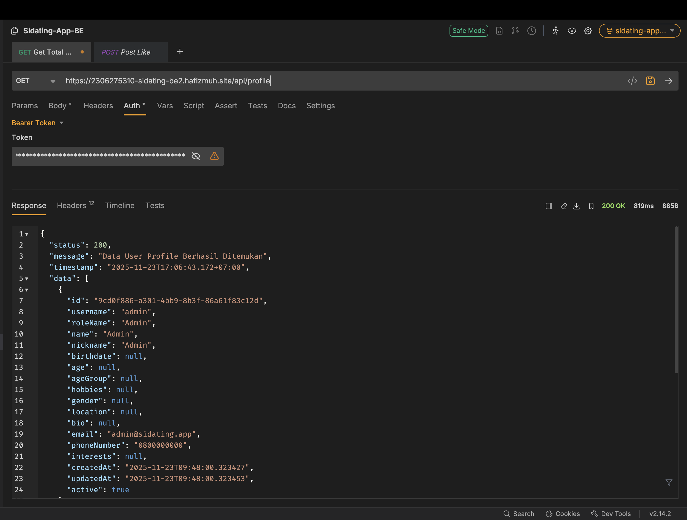
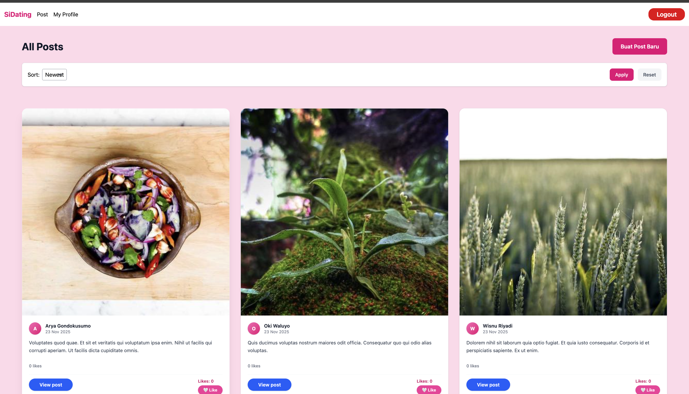
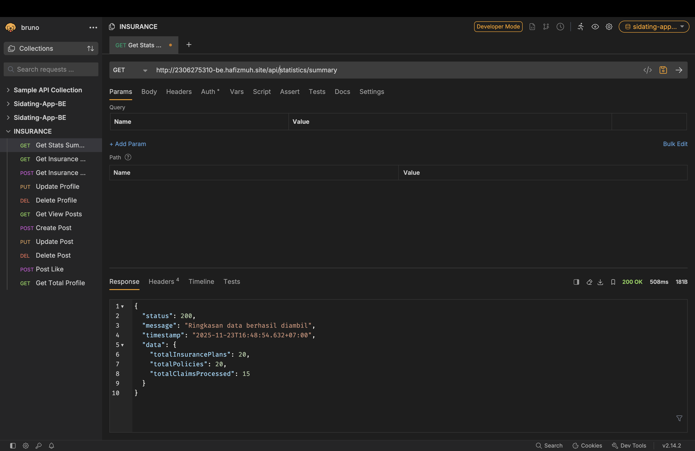
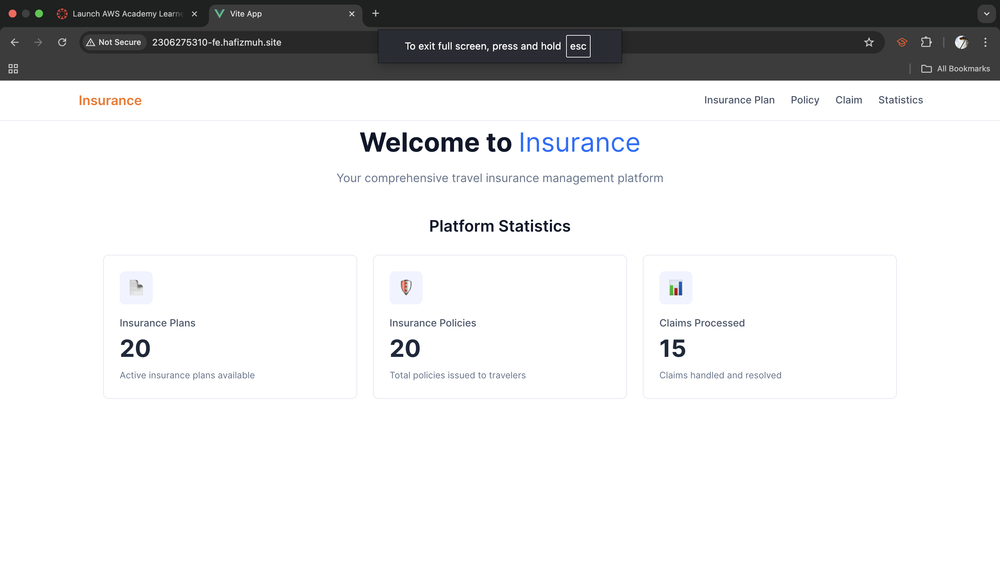

# Tugas Individu 3 - CI/CD & Kubernetes

**Nama:** Khayla Naura Ulya Luqyana  
**NPM:** 2306275310  
**Kelas:** APAP  

------------

## Pertanyaan 1

**Soal:**
Masukan bukti screenshot bahwa kalian sudah berhasil melakukan deploy Sidating BE1, BE2 dan FE, serta BE dan FE Tugas Individu. Untuk sidating, masukan screenshot seperti bagian pada Test-BE1, Test-BE2 dn Test-FE di halaman 39. Untuk TI masukan screenshot untuk BE tampilkan salah satu request (bebas yang mana saja) pada bruno/postman menghasilkan response yang valid, pastikan juga url nya ada pada screenshot dan untuk FE tampilkan screenshot halaman sudah dapat diakses dengan url hasil deployment, pastikan ur nya juga ada pada screenshot.

**Jawab:**

### A. Deployment Sidating 

**1. Bukti Deployment Sidating BE 1**

**2. Bukti Deployment Sidating BE 2**

**3. Bukti Deployment Sidating FE**

### B. Deployment Tugas Individu

**1. Bukti Deployment Backend (TI)**

**2. Bukti Deployment Frontend (TI)**

## Pertanyaan 2
Buatlah gambar pipeline CI/CD kalian sendiri, sesuai dengan yang kalian lakukan pada deployment Tugas Individunya (buatkan untuk Spring Boot saja), dan berikan deskripsi singkatnya !

**Jawab:**

**Deskripsi Singkat:**

* **Fase CI (Continuous Integration) - Garis Pink:**
    1.  **Commit & Push (Trigger CI):** Proses dimulai saat kode di-push ke repository GitLab. Ini menjadi pemicu otomatis berjalannya pipeline.
    2.  **Build Stage (Gradle Build → JAR):** Sistem mengompilasi kode Java menggunakan Gradle untuk menghasilkan artifact aplikasi berupa file `.jar`.
    3.  **Docker Push Stage (Build Image → Docker Hub):** File `.jar` dibungkus menjadi Docker Image dan diunggah ke registry Docker Hub agar siap diambil oleh server.

* **Fase CD (Continuous Deployment) - Garis Hijau:**
    4.  **Deploy Stage:** Pipeline masuk ke server (EC2) melalui SSH. Di sini, konfigurasi dibuat (*generate config*), dan perintah `kubectl apply` dijalankan untuk memperbarui aplikasi di Kubernetes cluster.

## Pertanyaan 3
Buatlah gambar pipeline CI/CD Improvement, yang menggambarkan pipeline yang lebih complete dan terstruktur dibandingkan pipeline yang sekarang kalian terapkan jika kalian bisa melakukan perbaikan apa yang akan kalian tambahkan/perbaiki dari pipeline yang telah digunakan sebelumnya), berikan juga penjelasan singkat terkait improvement yang kalian lakukan!

**Jawab:**

**Penjelasan Improvement:**

* **Fase CI (Continuous Integration) - Garis Pink:**
    1.  **Code (Commit):** Tahap awal penggabungan kode dari developer.
    2.  **Test (Gradle):** Menambahkan tahap *Unit Testing* di awal. Tujuannya agar jika ada error pada logika kode, proses langsung berhenti (*fail fast*) sebelum membuang waktu untuk build.
    3.  **Build (Build JAR):** Jika test lolos, baru kode di-build menjadi file JAR.
    4.  **Package (Docker Img):** Aplikasi dibungkus menjadi image container.

* **Fase CD (Continuous Deployment) - Garis Hijau:**
    5.  **Deploy Staging:** Aplikasi tidak langsung ke Production, tapi di-deploy dulu ke environment Staging (lingkungan uji coba) untuk memastikan aplikasi berjalan stabil.
    6.  **Manual Approval:** Titik pengecekan manual. Pipeline akan berhenti sementara (*pause*) menunggu konfirmasi/persetujuan dari tim pengembang setelah mereka mengecek hasil di Staging.
    7.  **Deploy Prod:** Setelah disetujui, barulah aplikasi di-deploy ke environment Production untuk digunakan oleh user asli.

## Pertanyaan 4
Pada EC2 instance yang kalian gunakan, kalian diperintahkan untuk mengaitkan dengan Elastic IP. Mengapa demikian ? Lalu apa yang terjadi jika kalian tidak mengaitkan instance dengan Elastic IP ?

**Jawab:**
Elastic IP (EIP) adalah alamat IPv4 statis. Jika kita tidak menggunakan Elastic IP, setiap kali instance EC2 dimatikan (*stop*) dan dinyalakan kembali (*start*), AWS akan memberikan alamat IP publik baru secara acak.

Jika IP berubah, konfigurasi DNS (domain `hafizmuh.site` yang mengarah ke server) akan menjadi tidak valid. Akibatnya, website tidak bisa diakses (*error connection timeout*) sampai kamu mengupdate DNS record dengan IP baru secara manual. Dengan Elastic IP, alamat IP tetap sama meskipun server di-restart.

## Pertanyaan 5
Apa perbedaan utama dari penggunaan Docker dan Kubernetes pada praktikum ini ?

**Jawab:**
* **Docker:** Pada praktikum sebelumnya atau penggunaan Docker biasa, manajemen container dilakukan secara **imperatif** dan manual (satu per satu) menggunakan `docker run` atau `docker-compose`. Fokusnya hanya pada menjalankan container di level OS.
* **Kubernetes (K3s):** Pada praktikum ini, kita memberikan file YAML (`deployment.yaml`) yang mendefinisikan keadaan yang diinginkan (*Desired State*). Kubernetes bertanggung jawab mengatur networking (Service), routing (Ingress), dan memastikan container tetap hidup (*Self-healing*).

## Pertanyaan 6
Dari keseluruhan pipeline yang dibuat, menurutmu proses mana yang paling penting dan mengapa ?

**Jawab:**
Meskipun build dan push itu penting, proses deployment di `gitlab-ci.yml` melakukan hal yang sangat penting, yaitu **Injecting Secrets**. Script di stage deploy mengambil variabel aman dari GitLab CI/CD (`DATABASE_PASSWORD`, `JWT_SECRET_KEY`) dan mengubahnya menjadi file Kubernetes (`secret.yaml`) tepat sebelum aplikasi dijalankan. Tanpa proses ini, aplikasi akan gagal koneksi ke database atau menjadi tidak aman.

## Pertanyaan 7
Pada konfigurasi kubernetes, sebenarnya kalian menggunakan 5 file konfigurasi 3 pada repository folder k8s dan 2 (secret.yaml & config.yaml) dibuat pada gitlab-ci.yml. Buatkan penjelasan kegunaan dari kelima file tersebut !

**Jawab:**

* **deployment.yaml:**
    Mendefinisikan "blueprint" aplikasi: image docker apa yang dipakai, berapa jumlah replika (pod) yang jalan, dan environment variable apa yang perlu diambil. Ini memastikan aplikasi berjalan.
* **service.yaml:**
    Bertindak sebagai penghubung internal stabil. Karena Pod bisa mati dan ganti IP, Service memberikan satu titik akses (ClusterIP) agar komponen lain (seperti Ingress) bisa berkomunikasi dengan Pod aplikasi tanpa peduli IP pod-nya berubah-ubah.
* **ingress.yaml:**
    Mengatur akses dari luar (internet). File ini memberitahu Ingress Controller (Traefik) untuk meneruskan traffic dari domain menuju ke service aplikasi.
* **configmap.yaml (Dibuat di pipeline):**
    Menyimpan konfigurasi yang tidak sensitif, seperti URL Database (`DATABASE_URL_PROD`) dan Username Database. Ini memisahkan konfigurasi dari kode program.
* **secret.yaml (Dibuat di pipeline):**
    Menyimpan data sensitif (rahasia), seperti `DATABASE_PASSWORD` dan `JWT_SECRET_KEY`. Di Kubernetes, isinya di-encode (base64) dan tidak boleh ditaruh sembarangan di repository publik.
    
## Pertanyaan 8
Tanpa kalian sadari konfigurasi yang sudah kalian lakukan baik untuk docker database maupun deployment kubernetes sudah menerapkan start on restart, padahal by default docker dan kubernetes tidak menerapkan ini (jika server dimatikan lalu dinyalakan ulang service tetap mati dan harus dinyalakan ulang). Jelaskan dibagian mana sistem start on restart ini kalian terapkan dan bagaimana diterapkannya ?

**Jawab:**
Konsep "start on restart" di Kubernetes diterapkan melalui resource Deployment (file deployment.yaml).

Secara default, Kubernetes bersifat deklaratif. Di dalam deployment.yaml tertulis:

spec:
  replicas: 1

Artinya, memerintahkan Kubernetes: "Pastikan SELALU ada 1 pod yang menyala".

Jika server EC2 dimatikan lalu dinyalakan ulang:
- Service K3s akan start otomatis (karena di-install sebagai service systemd di Linux).
- K3s mengecek status cluster dan melihat bahwa Pod insurance-be belum berjalan.
- K3s segera menjalankan pod tersebut untuk memenuhi aturan replicas: 1. Berbeda dengan Docker biasa yang butuh flag --restart always, Kubernetes melakukannya secara natural melalui Controller Manager.

## Pertanyaan 9 
Apa keuntungan dari menerapkan kubernetes pada proses deployment kalian, dibandingkan langsung run image docker saja di server ?

**Jawab:**
* **Zero Downtime Deployment:** Dengan Kubernetes, saat update versi aplikasi, ia bisa melakukan *Rolling Update* (menyalakan pod baru dulu, baru mematikan pod lama), sehingga user tidak merasakan server down. Kalau `docker run`, aplikasi harus dimatikan dulu baru dinyalakan lagi.
* **Manajemen Konfigurasi (ConfigMap/Secret):** Memisahkan credentials dari container image jauh lebih rapi dan aman dibanding passing environment variable manual yang panjang saat `docker run`.
* **Scalability:** Jika trafik tinggi, cukup ganti `replicas: 5` di Kubernetes, load akan dibagi otomatis. Di Docker biasa, kita harus setup load balancer manual.
* **Self-Healing:** Jika aplikasi crash (error), Kubernetes otomatis merestart-nya.

## Pertanyaan 10 
Jelaskan perbedaan antara ketiga tipe service dari kubernetes, yaitu ClusterIP, NodePort dan LoadBalancer ? Dan kira-kira mengapa menggunakan ClusterIP merupakan pilihan yang sesuai untuk praktikum ini ?

**Jawab:**

* **ClusterIP:** Hanya memberi IP internal di dalam cluster. Tidak bisa diakses langsung dari internet. (Paling aman).
* **NodePort:** Membuka port spesifik (misal: 30001) di IP server (EC2). Bisa diakses publik jika firewall dibuka, tapi kurang aman dan port terbatas.
* **LoadBalancer:** Meminta Cloud Provider (AWS/GCP) untuk menyediakan Load Balancer fisik/virtual (berbayar mahal) yang punya IP Publik sendiri.

**Mengapa ClusterIP?**
ClusterIP cocok untuk praktikum ini karena menggunakan **Ingress Controller (Traefik)**. Pola standar Kubernetes adalah: `Internet -> Ingress (Pintu Gerbang Utama) -> Service (ClusterIP) -> Pod`. Ingress bertugas menerima trafik publik, lalu meneruskannya secara internal ke Service. Jadi, Service-nya cukup tipe ClusterIP saja karena tidak perlu terekspos langsung ke internet, cukup Ingress yang terekspos.

## Pertanyaan 11
Apa pelajaran terpenting yang kamu dapatkan dari proses deployment otomatis ini, dan bagaimana konsep CI/CD bisa diterapkan pada proyek lain?

**Jawab:**

**Pelajaran Terpenting:**
Pelajaran utama bagi saya adalah pentingnya **ketelitian dalam pemetaan variabel antar-sistem**.
Saya menyadari bahwa tantangan terbesar dalam CI/CD dan Kubernetes bukanlah pada penulisan kode Java-nya, melainkan pada **integrasi konfigurasi**. Memastikan variabel di GitLab CI terhubung dengan benar ke script injection, lalu masuk ke ConfigMap/Secret, hingga akhirnya terbaca oleh container di Kubernetes membutuhkan ketelitian tinggi. Kesalahan kecil pada tahap *injection* ini bisa berakibat fatal (aplikasi gagal start) dan mengajarkan saya untuk selalu memvalidasi konfigurasi secara berlapis.

**Penerapan di Proyek Lain:**
Prinsip otomatisasi ini bisa diterapkan untuk meningkatkan efisiensi tim dalam proyek apapun:
1.  **Quality Gate Otomatis:** Pada proyek tim, CI/CD bisa digunakan untuk menolak kode yang mengandung *bug* atau tidak lolos *test* secara otomatis sebelum kode tersebut di-*merge* ke branch utama.
2.  **Continuous Delivery:** Pada pengembangan produk rintisan (startup), CI/CD memungkinkan tim untuk merilis fitur baru ke user berkali-kali dalam sehari (*multiple deploys per day*) dengan risiko kesalahan manusia yang minimal.